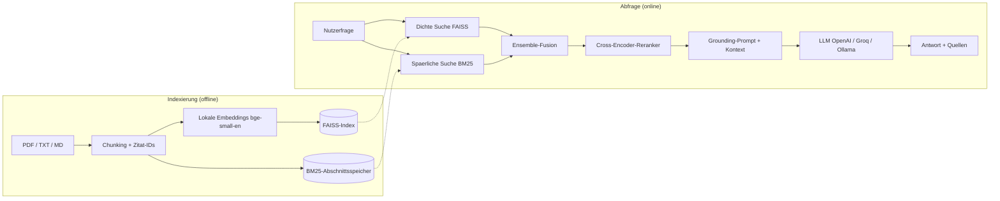
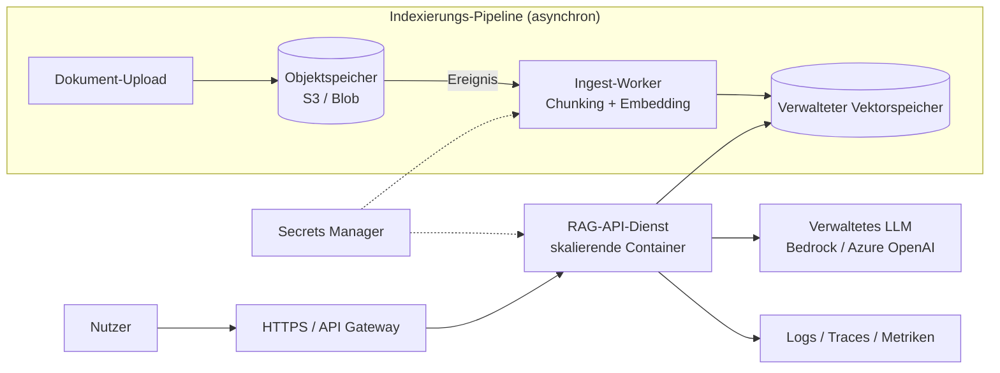

# NeoDocuMind - Produktionsreifer RAG-Dokumentenassistent

**Sprachen:** [English](README.md) | Deutsch

> Stellen Sie Fragen in natuerlicher Sprache zu Ihren eigenen Dokumenten und
> erhalten Sie fundierte, mit Quellen belegte Antworten, ermoeglicht durch
> hybride Suche, Cross-Encoder-Reranking und eine anbieterunabhaengige
> LLM-Schicht.

<p align="left">
  
  
  
  
</p>

NeoDocuMind ist ein kompaktes, aber realistisches System fuer Retrieval-Augmented
Generation (RAG): jene "Chat mit Ihren Dokumenten"-Faehigkeit, die heute fast
jedes Unternehmen fuer Support, Compliance, Onboarding und interne Wissenssuche
benoetigt. Es ist bewusst wie ein Produkt aufgebaut, nicht wie ein Notebook: ein
modulares Paket, eine REST-API, eine Web-Oberflaeche, ein Evaluierungsframework
mit echten Metriken, Tests, CI und Docker.

---

## Warum dieses Projekt

Naives RAG ("alles einbetten, eine Vektorsuche durchfuehren, alles in einen
Prompt kippen") scheitert an echten Datenbestaenden: Es uebersieht exakte
Schluesselwoerter, liefert irrelevante Textabschnitte und halluziniert.
NeoDocuMind adressiert jeden dieser Schwachpunkte gezielt.

| Problem bei naivem RAG | Ansatz von NeoDocuMind |
| --- | --- |
| Uebersieht exakte Begriffe / IDs / Abkuerzungen | Hybride Suche: dicht (FAISS) plus spaerlich (BM25) |
| Top-k-Vektortreffer sind verrauscht | Cross-Encoder-Reranker bewertet (Frage, Abschnitt)-Paare neu |
| Modell erfindet Fakten | Strenger Grounding-Prompt plus Inline-Quellenangaben fuer jede Aussage |
| "Es funktioniert bei meinem einen Beispiel" | Evaluierungsframework mit Hit@k, MRR und Antwortbewertung |
| An einen Anbieter gebunden | Anbieterunabhaengiges LLM (OpenAI / Groq / Ollama) ueber eine Variable |
| Kostet Geld zum Ausprobieren | Lokale Embeddings plus Reranker laufen kostenlos, ohne API-Schluessel |

---

## Architektur



Die Pipeline ist in klar getrennte, austauschbare Module unterteilt.

| Modul | Aufgabe |
| --- | --- |
| `ingest.py` | PDF/TXT/MD laden und mit stabilen Zitat-IDs in Abschnitte teilen |
| `embeddings.py` | Lokale sentence-transformers-Embeddings (kein Schluessel) |
| `vectorstore.py` | FAISS-Index erstellen / speichern / laden (austauschbar gegen Qdrant, pgvector) |
| `retriever.py` | Hybrides dicht+BM25-Ensemble plus Cross-Encoder-Reranking |
| `llm.py` | Anbieterunabhaengige Chat-Modell-Factory |
| `pipeline.py` | Abrufen, Grounding-Prompt erstellen, belegte Antwort zurueckgeben |
| `api.py` | FastAPI-Dienst (`/ask`, `/health`) |
| `app/streamlit_app.py` | Chat-Oberflaeche mit aufklappbaren Quellenangaben |
| `eval/evaluate.py` | Metriken fuer Abruf- und Antwortqualitaet |

Das Python-Paket behaelt den Modulnamen `documind`; das Projekt und das
Repository tragen die Marke NeoDocuMind.

---

## Ergebnisse

Gemessen an einem handannotierten Benchmark mit 12 Fragen ueber dem
mitgelieferten Beispielkorpus (`python -m eval.evaluate`). Embeddings und
Reranking sind lokale Modelle, daher laeuft dies kostenlos und offline.

| Metrik | Wert |
| --- | --- |
| Fragen | 12 |
| Hit@4 (korrekte Quelle abgerufen) | 1.00 |
| MRR (mittlerer reziproker Rang) | 1.00 |
| Embedding-Modell | `BAAI/bge-small-en-v1.5` |
| Reranker-Modell | `cross-encoder/ms-marco-MiniLM-L-6-v2` |

Der Beispielkorpus ist klein und kuratiert, daher sind die Werte konstruktionsbedingt
hoch. Entscheidend ist, dass das Framework echt ist: Mit einem groesseren,
verrauschteren Korpus werden dieselben Metriken wirklich aussagekraeftig. Mit
`--with-llm` werden zusaetzlich generierte Antworten bewertet (Schluesselwort-Recall
gegen Referenzantworten).

---

## Schnellstart

### 1. Installation

```bash
git clone https://github.com/TheCodePadawan/NeoDocuMind.git
cd NeoDocuMind

python -m venv .venv
# Windows:
.venv\Scripts\activate
# macOS/Linux:
source .venv/bin/activate

pip install -r requirements.txt
```

### 2. Konfiguration (fuer die Demo optional)

```bash
cp .env.example .env      # Windows: copy .env.example .env
```

Embeddings und Reranking benoetigen keinen Schluessel. Fuer die Antwortgenerierung
waehlen Sie eine Option:

- OpenAI (guenstigste zuverlaessige Option): `OPENAI_API_KEY` setzen,
  `LLM_PROVIDER=openai` belassen.
- Groq (kostenloses Kontingent): `GROQ_API_KEY` setzen, `LLM_PROVIDER=groq`.
- Ollama (vollstaendig lokal und kostenlos): [Ollama](https://ollama.com)
  installieren, `ollama pull llama3.1` ausfuehren, `LLM_PROVIDER=ollama` setzen.

### 3. Index erstellen

```bash
python -m scripts.ingest_sample
# ...oder auf einen eigenen Ordner verweisen:
python -m scripts.ingest_sample --source pfad/zu/ihren/dokumenten
```

### 4. Fragen stellen

```bash
# Web-Oberflaeche
streamlit run app/streamlit_app.py

# REST-API
uvicorn documind.api:app --reload      # dann POST /ask

# Einzelne Frage ueber die Kommandozeile
python -m scripts.ask "Wie viele Urlaubstage kann ich uebertragen?"
```

Beispiel fuer einen API-Aufruf:

```bash
curl -X POST http://localhost:8000/ask \
  -H "Content-Type: application/json" \
  -d '{"question": "Welche Verfuegbarkeit garantiert das Enterprise-SLA?"}'
```

### Mit Docker ausfuehren

```bash
docker compose up --build      # API auf :8000, UI auf :8501
```

---

## Evaluierung und Tests

```bash
python -m eval.evaluate            # Abruf-Metriken (kostenlos, offline)
python -m eval.evaluate --with-llm # zusaetzlich generierte Antworten bewerten

pytest                             # Unit-Tests
ruff check .                       # Linting
```

CI (GitHub Actions) fuehrt bei jedem Push Linting und Tests fuer Python 3.10 bis
3.12 aus.

---

## Produktivbetrieb (AWS / Azure)

Dieses Repository laeuft der Klarheit halber als einzelner Prozess, ist aber so
aufgebaut, dass jede Schicht sauber auf verwaltete Cloud-Dienste abgebildet
werden kann. Die schmalen Schnittstellen (`vectorstore.py`, `llm.py`,
`embeddings.py`) sind die Stellen zum Austauschen.

### Von der Demo zur Produktion: was sich aendert

| Aspekt | Diese Demo | Produktion |
| --- | --- | --- |
| Vektorspeicher | FAISS-Datei auf lokaler Festplatte | Verwaltet: AWS OpenSearch / Aurora pgvector oder Azure AI Search |
| Dokumente | Lokaler `data/`-Ordner | Objektspeicher: S3 oder Azure Blob Storage |
| Indexierung | Beim Start / per CLI | Ereignisgesteuerter Job beim Hochladen eines Dokuments |
| Embeddings | Lokale sentence-transformers | Batch-Endpoint (SageMaker / Azure ML) oder gehostete API |
| LLM | Ein Anbieter ueber Umgebungsvariable | Verwalteter Endpoint: AWS Bedrock oder Azure OpenAI, hinter einem Gateway |
| Auslieferung | Ein Container | Automatisch skalierende Container hinter einem Load Balancer |
| Geheimnisse | `.env`-Datei | AWS Secrets Manager / Azure Key Vault |
| Beobachtbarkeit | Konsolen-Logs | Tracing, Metriken und Online-Evaluierung (Latenz, Fundiertheit) |

### Produktionsarchitektur



### AWS-Referenzstack

- **Container**: mit dem enthaltenen `Dockerfile` paketieren, nach ECR pushen,
  auf ECS Fargate (oder EKS) hinter einem Application Load Balancer betreiben.
- **Vektorspeicher**: Amazon OpenSearch Service (k-NN) oder Aurora PostgreSQL
  mit `pgvector`. Nur `vectorstore.py` austauschen, der Rest bleibt gleich.
- **Dokumente + Indexierung**: nach S3 hochladen, beim `s3:ObjectCreated`-Ereignis
  eine Lambda- oder Fargate-Aufgabe zum Chunking, Embedding und Upsert ausloesen.
- **LLM + Embeddings**: Amazon Bedrock fuer die Generierung; SageMaker oder
  Bedrock fuer Embeddings.
- **Geheimnisse / Konfiguration**: AWS Secrets Manager + SSM Parameter Store.
- **CI/CD**: GitHub Actions baut und pusht das Image und deployt nach ECS.

### Azure-Referenzstack

- **Container**: Azure Container Apps (oder AKS), Image in der Azure Container
  Registry.
- **Vektorspeicher**: Azure AI Search (Vektor + hybrid + semantisches Ranking)
  oder Azure Database for PostgreSQL mit `pgvector`.
- **Dokumente + Indexierung**: Azure Blob Storage mit Event-Grid-Trigger, der
  eine Azure Function / einen Container-App-Job zur Indexierung aufruft.
- **LLM + Embeddings**: Azure-OpenAI-Deployments.
- **Geheimnisse / Konfiguration**: Azure Key Vault + App Configuration.
- **CI/CD**: GitHub Actions nach ACR, dann Deployment in Container Apps.

### Produktions-Checkliste

- Den **Indexierungs-Job** vom **Abfrage-Dienst** trennen, damit aufwaendiges
  Indexieren keine Nutzeranfragen blockiert und unabhaengig skalieren kann.
- Einen **verwalteten, persistenten Vektorspeicher** nutzen (die lokale
  FAISS-Datei ueberlebt keinen Container-Neustart und skaliert nicht horizontal).
- **Authentifizierung** (API-Schluessel / OAuth), **Rate Limiting** und
  **Mandantentrennung** ergaenzen, falls Dokumente kundenspezifisch sind.
- **Beobachtbarkeit** ergaenzen: Request-Tracing, Abruf-/Antwort-Latenz,
  Token-Kosten und **Online-Evaluierung** (Stichproben echten Traffics).
- Das **Offline-Evaluierungsframework in der CI** behalten, damit Abrufqualitaet
  bei jeder Aenderung ein Gate ist, kein nachtraeglicher Gedanke.
- Embeddings und haeufige Antworten cachen; Dokument-Embeddings fuer Durchsatz
  batchen.

### "Wie wuerden Sie das produktiv umsetzen?" (Kurzfassung)

> Dieselbe Retrieve-Rerank-Generate-Pipeline beibehalten, aber in einen
> asynchronen Indexierungsdienst und eine zustandslose Abfrage-API aufteilen.
> Dokumente im Objektspeicher und Vektoren in einem verwalteten Speicher
> (pgvector / OpenSearch / Azure AI Search) ablegen. Ein verwaltetes LLM
> (Bedrock / Azure OpenAI) ueber ein Gateway aufrufen, Geheimnisse im Vault.
> Als Container mit Autoscaling ausliefern, Tracing und Kostenmetriken einbinden
> und die Evaluierungs-Suite in der CI behalten, damit Abrufqualitaet bei jedem
> Deployment gemessen wird.

---

## Projektstruktur

```
NeoDocuMind/
├── src/documind/        # die RAG-Bibliothek (importierbar, getestet)
├── app/                 # Streamlit-Demo-Oberflaeche
├── scripts/             # ingest- und ask-Kommandozeilenwerkzeuge
├── eval/                # Benchmark-Datensatz und Evaluierungsframework
├── data/sample_docs/    # Demo-Korpus (Handbuch, Sicherheitsrichtlinie, Produkt-FAQ)
├── tests/               # reine Python-Unit-Tests (schnell, keine Modell-Downloads)
├── .github/workflows/   # CI-Pipeline
├── Dockerfile / docker-compose.yml
└── requirements*.txt
```

---

## Roadmap

- [ ] Streaming-Antworten Token fuer Token in API und UI
- [ ] Austauschbarer verwalteter Vektorspeicher (Qdrant / pgvector) hinter derselben Schnittstelle
- [ ] LLM-als-Judge-Metriken fuer Treue und Antwortrelevanz (RAGAS-Stil)
- [ ] Multimodale Indexierung (Tabellen und Abbildungen aus PDFs)
- [ ] Konversationsgedaechtnis und mehrstufige Anfrageumformulierung

---

## Designentscheidungen

- Warum hybrid plus Rerank? Reine dichte Suche uebersieht exakte Tokens; reines
  BM25 uebersieht Paraphrasen. Die Fusion beider und anschliessendes Reranking
  mit einem Cross-Encoder verbindet beide Staerken bei minimaler zusaetzlicher
  Latenz.
- Warum standardmaessig lokale Embeddings? Reproduzierbarkeit und Nullkosten:
  Jeder kann das vollstaendige Abruf- und Evaluierungssystem ohne Kreditkarte
  klonen und ausfuehren.
- Warum eine duenne Vektorspeicher-Schicht? Damit FAISS gegen einen
  Produktionsspeicher ausgetauscht werden kann, ohne Abruf, Prompting oder API zu
  beruehren.

---

## Lizenz

[MIT](LICENSE). Frei nutzbar, zum Lernen und Weiterentwickeln.
