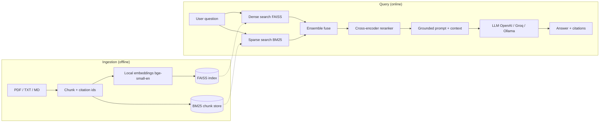
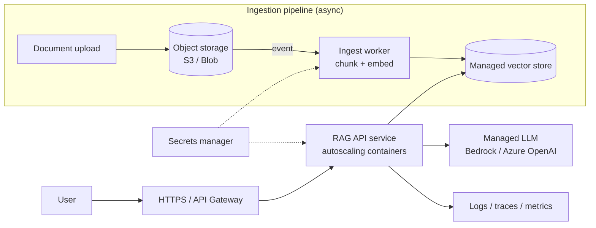

# NeoDocuMind - Production-Grade RAG Document Assistant

**Languages:** English | [Deutsch](README.de.md)

> Ask natural-language questions over your own documents and get grounded, cited
> answers, powered by hybrid retrieval, cross-encoder reranking, and a
> provider-agnostic LLM layer.

<p align="left">
  <a href="https://github.com/TheCodePadawan/NeoDocuMind/actions/workflows/ci.yml">
    
  </a>
  
  <a href="LICENSE"></a>
  <a href="https://github.com/astral-sh/ruff"></a>
</p>

NeoDocuMind is a compact but realistic Retrieval-Augmented Generation (RAG)
system: the kind of "chat with your documents" capability almost every company
now wants for support, compliance, onboarding, and internal knowledge search.
It is intentionally built like a product, not a notebook: a modular package, a
REST API, a web UI, an evaluation harness with real metrics, tests, CI, and
Docker.

---

## Why this project

Naive RAG ("embed everything, do one vector search, dump it into a prompt")
fails on real corpora: it misses exact keywords, surfaces irrelevant chunks, and
hallucinates. NeoDocuMind addresses each failure mode explicitly.

| Problem with naive RAG | NeoDocuMind's approach |
| --- | --- |
| Misses exact terms / IDs / acronyms | Hybrid retrieval: dense (FAISS) plus sparse (BM25) |
| Top-k vector hits are noisy | Cross-encoder reranker re-scores (query, chunk) pairs |
| Model invents facts | Strict grounding prompt plus inline citations for every claim |
| "It works on my one example" | Evaluation harness with Hit@k, MRR, and answer scoring |
| Locked to one vendor | Provider-agnostic LLM (OpenAI / Groq / Ollama) via one variable |
| Costs money to try | Local embeddings plus reranker run free, no API key |

---

## Architecture



The pipeline is split into a clean, swappable set of modules.

| Module | Responsibility |
| --- | --- |
| `ingest.py` | Load PDF/TXT/MD and chunk with stable citation ids |
| `embeddings.py` | Local sentence-transformers embeddings (no key) |
| `vectorstore.py` | FAISS index build / save / load (swappable for Qdrant, pgvector) |
| `retriever.py` | Hybrid dense+BM25 ensemble plus cross-encoder reranking |
| `llm.py` | Provider-agnostic chat model factory |
| `pipeline.py` | Retrieve, build grounded prompt, return cited answer |
| `api.py` | FastAPI service (`/ask`, `/health`) |
| `app/streamlit_app.py` | Chat UI with expandable source citations |
| `eval/evaluate.py` | Retrieval and answer-quality metrics |

The Python package keeps its module name `documind`; the project and repository
are branded NeoDocuMind.

---

## Results

Measured on a hand-labelled 12-question benchmark over the bundled sample corpus.
Retrieval metrics use local models and run for free and offline; answer-quality
metrics use the configured LLM (here Groq `llama-3.3-70b-versatile`).

**Retrieval** (`python -m eval.evaluate`)

| Metric | Score |
| --- | --- |
| Questions | 12 |
| Hit@4 (correct source retrieved) | 1.00 |
| MRR (mean reciprocal rank) | 1.00 |
| Embedding model | `BAAI/bge-small-en-v1.5` |
| Reranker model | `cross-encoder/ms-marco-MiniLM-L-6-v2` |

**Answer quality** (`python -m eval.evaluate --judge`)

| Metric | Score |
| --- | --- |
| Keyword recall vs. gold answers | 1.00 |
| LLM-judge faithfulness (1-5, anti-hallucination) | 5.00 |
| LLM-judge relevance (1-5) | 5.00 |

The sample corpus is small and curated, so scores are high by design. The point
is that the harness is real: drop in a larger, noisier corpus and the same
metrics become genuinely discriminating. The **LLM-as-judge** grades each answer
for faithfulness (every claim supported by retrieved context) and relevance,
which is exactly how you catch hallucination in a real RAG system.

---

## Quickstart

### 1. Install

```bash
git clone https://github.com/TheCodePadawan/NeoDocuMind.git
cd NeoDocuMind

python -m venv .venv
# Windows:
.venv\Scripts\activate
# macOS/Linux:
source .venv/bin/activate

pip install -r requirements.txt
```

### 2. Configure (optional for the demo)

```bash
cp .env.example .env      # Windows: copy .env.example .env
```

Embeddings and reranking need no key. For answer generation, pick one:

- OpenAI (cheapest reliable): set `OPENAI_API_KEY`, keep `LLM_PROVIDER=openai`.
- Groq (free tier): set `GROQ_API_KEY`, set `LLM_PROVIDER=groq`.
- Ollama (fully local and free): install [Ollama](https://ollama.com), run
  `ollama pull llama3.1`, set `LLM_PROVIDER=ollama`.

### 3. Build the index

```bash
python -m scripts.ingest_sample
# ...or point it at your own folder:
python -m scripts.ingest_sample --source path/to/your/docs
```

### 4. Ask away

```bash
# Web UI
streamlit run app/streamlit_app.py

# REST API
uvicorn documind.api:app --reload      # then POST /ask

# One-off CLI question
python -m scripts.ask "How many PTO days can I carry over?"
```

Example API call:

```bash
curl -X POST http://localhost:8000/ask \
  -H "Content-Type: application/json" \
  -d '{"question": "What uptime does the Enterprise SLA guarantee?"}'
```

```json
{
  "question": "What uptime does the Enterprise SLA guarantee?",
  "answer": "Enterprise customers are guaranteed 99.9% monthly uptime. [product_faq.md#5]",
  "sources": [{ "citation_id": "product_faq.md#5", "source": "product_faq.md" }]
}
```

### Run with Docker

```bash
docker compose up --build      # API on :8000, UI on :8501
```

---

## Evaluation and testing

```bash
python -m eval.evaluate            # retrieval metrics (free, offline)
python -m eval.evaluate --with-llm # also score answers (keyword recall)
python -m eval.evaluate --judge    # add LLM-as-judge faithfulness + relevance

pytest                             # unit tests
ruff check .                       # lint
```

CI (GitHub Actions) runs lint and tests across Python 3.10 to 3.12 on every push.

---

## Deploying to production (AWS / Azure)

This repository runs as a single process for clarity, but it is structured so
each layer maps cleanly onto managed cloud services. The thin interfaces
(`vectorstore.py`, `llm.py`, `embeddings.py`) are the seams you swap.

### From demo to production: what changes

| Concern | This demo | Production |
| --- | --- | --- |
| Vector store | FAISS file on local disk | Managed: AWS OpenSearch / Aurora pgvector, or Azure AI Search |
| Documents | Local `data/` folder | Object storage: S3 or Azure Blob Storage |
| Ingestion | Run on startup / CLI | Event-driven job triggered when a document is uploaded |
| Embeddings | Local sentence-transformers | Batch endpoint (SageMaker / Azure ML) or a hosted embedding API |
| LLM | Single provider via env var | Managed endpoint: AWS Bedrock or Azure OpenAI, behind a gateway |
| Serving | One container | Autoscaling containers behind a load balancer |
| Secrets | `.env` file | AWS Secrets Manager / Azure Key Vault |
| Observability | Console logs | Tracing, metrics, and online eval (latency, groundedness) |

### Production architecture



### AWS reference stack

- **Containers**: package with the included `Dockerfile`, push to ECR, run on
  ECS Fargate (or EKS) behind an Application Load Balancer.
- **Vector store**: Amazon OpenSearch Service (k-NN) or Aurora PostgreSQL with
  `pgvector`. Swap `vectorstore.py` for that client; the rest is unchanged.
- **Documents + ingestion**: upload to S3, trigger a Lambda or Fargate task on
  the `s3:ObjectCreated` event to chunk, embed, and upsert vectors.
- **LLM + embeddings**: Amazon Bedrock for generation; SageMaker or Bedrock for
  embeddings.
- **Secrets / config**: AWS Secrets Manager + SSM Parameter Store.
- **CI/CD**: GitHub Actions builds and pushes the image, then deploys to ECS.

### Azure reference stack

- **Containers**: Azure Container Apps (or AKS), image stored in Azure Container
  Registry.
- **Vector store**: Azure AI Search (vector + hybrid + semantic ranking) or
  Azure Database for PostgreSQL with `pgvector`.
- **Documents + ingestion**: Azure Blob Storage with an Event Grid trigger
  invoking an Azure Function / Container App job to ingest.
- **LLM + embeddings**: Azure OpenAI deployments.
- **Secrets / config**: Azure Key Vault + App Configuration.
- **CI/CD**: GitHub Actions to ACR, then deploy to Container Apps.

### Production checklist

- Separate the **ingestion job** from the **query service** so heavy indexing
  never blocks user requests, and re-indexing can scale independently.
- Use a **managed, persistent vector store** (the local FAISS file does not
  survive container restarts and does not scale horizontally).
- Add **authentication** (API keys / OAuth), **rate limiting**, and **per-tenant
  isolation** if documents are customer-specific.
- Add **observability**: request tracing, retrieval/answer latency, token cost,
  and **online evaluation** (sample real traffic for groundedness/relevance).
- Keep the **offline evaluation harness in CI** so retrieval quality is a gate,
  not an afterthought, on every change.
- Cache embeddings and frequent answers; batch document embedding for throughput.

### "How would you implement this in production?" (short version)

> Keep the same retrieve-rerank-generate pipeline, but split it into an
> asynchronous ingestion service and a stateless query API. Store documents in
> object storage and vectors in a managed store (pgvector / OpenSearch / Azure AI
> Search). Call a managed LLM (Bedrock / Azure OpenAI) through a gateway, with
> secrets in a vault. Ship it as containers with autoscaling, wire in tracing and
> cost metrics, and keep the evaluation suite in CI so retrieval quality is
> measured on every deploy.

---

## Project structure

```
NeoDocuMind/
├── src/documind/        # the RAG library (importable, tested)
├── app/                 # Streamlit demo UI
├── scripts/             # ingest and ask CLIs
├── eval/                # benchmark dataset and evaluation harness
├── data/sample_docs/    # demo corpus (handbook, security policy, product FAQ)
├── tests/               # pure-python unit tests (fast, no model downloads)
├── .github/workflows/   # CI pipeline
├── Dockerfile / docker-compose.yml
└── requirements*.txt
```

---

## Roadmap

- [ ] Streaming token responses in the API and UI
- [ ] Swappable managed vector store (Qdrant / pgvector) behind the same interface
- [ ] LLM-as-judge faithfulness and answer-relevance metrics (RAGAS-style)
- [ ] Multimodal ingestion (tables and figures from PDFs)
- [ ] Conversation memory and multi-turn query rewriting

---

## Design notes

For a full component-by-component rationale (why hybrid, bi- vs cross-encoder,
FAISS vs Weaviate, fusion choices, evaluation, and trade-offs), see
[docs/DESIGN.md](docs/DESIGN.md).

- Why hybrid plus rerank? Dense search alone misses exact tokens; BM25 alone
  misses paraphrase. Fusing both and then reranking with a cross-encoder gives
  the best of both worlds at a tiny latency cost.
- Why local embeddings by default? Reproducibility and zero cost: anyone can
  clone and run the full retrieval and evaluation stack without a credit card.
- Why a thin vector-store layer? So FAISS can be swapped for a production store
  without touching retrieval, prompting, or the API.

---

## License

[MIT](LICENSE). Free to use, learn from, and build on.
