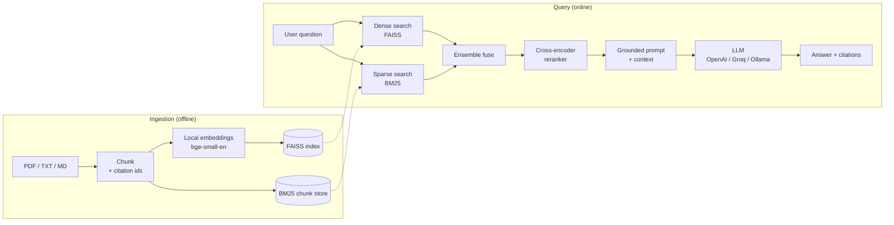

# 📄 DocuMind — Production-Grade RAG Document Assistant

> Ask natural-language questions over your own documents and get **grounded,
> cited answers** — powered by hybrid retrieval, cross-encoder reranking, and a
> provider-agnostic LLM layer.

<p align="left">
  
  
  
  
</p>

DocuMind is a compact but **realistic** Retrieval-Augmented Generation (RAG)
system — the kind of "chat with your documents" capability almost every company
now wants for support, compliance, onboarding, and internal knowledge search.
It is intentionally built like a product, not a notebook: modular package, REST
API, web UI, an **evaluation harness with real metrics**, tests, CI, and Docker.

---

## ✨ Why this project

Naïve RAG ("embed everything, do one vector search, dump it into a prompt")
fails on real corpora: it misses exact keywords, surfaces irrelevant chunks, and
hallucinates. DocuMind addresses each failure mode explicitly:

| Problem with naïve RAG | DocuMind's approach |
| --- | --- |
| Misses exact terms / IDs / acronyms | **Hybrid retrieval**: dense (FAISS) **+** sparse (BM25) |
| Top-k vector hits are noisy | **Cross-encoder reranker** re-scores (query, chunk) pairs |
| Model invents facts | Strict **grounding prompt** + **inline citations** for every claim |
| "It works on my one example" | **Evaluation harness** with Hit@k, MRR, and answer scoring |
| Locked to one vendor | **Provider-agnostic LLM** (OpenAI / Groq / Ollama) via one env var |
| Costs money to try | **Local embeddings + reranker** run free, no API key |

---

## 🏗️ Architecture



The pipeline is split into a clean, swappable set of modules:

| Module | Responsibility |
| --- | --- |
| `ingest.py` | Load PDF/TXT/MD and chunk with stable citation ids |
| `embeddings.py` | Local sentence-transformers embeddings (no key) |
| `vectorstore.py` | FAISS index build / save / load (swappable for Qdrant, pgvector) |
| `retriever.py` | Hybrid dense+BM25 ensemble + cross-encoder reranking |
| `llm.py` | Provider-agnostic chat model factory |
| `pipeline.py` | Retrieve → grounded prompt → cited answer |
| `api.py` | FastAPI service (`/ask`, `/health`) |
| `app/streamlit_app.py` | Chat UI with expandable source citations |
| `eval/evaluate.py` | Retrieval + answer-quality metrics |

---

## 📊 Results

Measured on a hand-labelled 12-question benchmark over the bundled sample corpus
(`python -m eval.evaluate`). Embeddings and reranking are local models, so this
runs for free and offline:

| Metric | Score |
| --- | --- |
| Questions | 12 |
| **Hit@4** (correct source retrieved) | **1.00** |
| **MRR** (mean reciprocal rank) | **1.00** |
| Embedding model | `BAAI/bge-small-en-v1.5` |
| Reranker model | `cross-encoder/ms-marco-MiniLM-L-6-v2` |

> The sample corpus is small and curated, so scores are high by design — the
> point is that the **harness is real**: drop in a larger, noisier corpus and the
> same metrics become genuinely discriminating. Add `--with-llm` to also score
> generated answers (keyword recall vs. gold answers).

---

## 🚀 Quickstart

### 1. Install

```bash
git clone https://github.com/<your-username>/documind.git
cd documind

python -m venv .venv
# Windows:
.venv\Scripts\activate
# macOS/Linux:
source .venv/bin/activate

pip install -r requirements.txt
```

### 2. Configure (optional for the demo)

```bash
cp .env.example .env      # Windows: copy .env.example .env
```

Embeddings/reranking need **no key**. For answer generation, pick one:

- **OpenAI** (cheapest reliable): set `OPENAI_API_KEY`, keep `LLM_PROVIDER=openai`.
- **Groq** (free tier): set `GROQ_API_KEY`, set `LLM_PROVIDER=groq`.
- **Ollama** (100% local/free): install [Ollama](https://ollama.com),
  `ollama pull llama3.1`, set `LLM_PROVIDER=ollama`.

### 3. Build the index

```bash
python -m scripts.ingest_sample
# ...or point it at your own folder:
python -m scripts.ingest_sample --source path/to/your/docs
```

### 4. Ask away

```bash
# Web UI
streamlit run app/streamlit_app.py

# REST API
uvicorn documind.api:app --reload      # then POST /ask

# One-off CLI question
python -m scripts.ask "How many PTO days can I carry over?"
```

Example API call:

```bash
curl -X POST http://localhost:8000/ask \
  -H "Content-Type: application/json" \
  -d '{"question": "What uptime does the Enterprise SLA guarantee?"}'
```

```json
{
  "question": "What uptime does the Enterprise SLA guarantee?",
  "answer": "Enterprise customers are guaranteed 99.9% monthly uptime. [product_faq.md#5]",
  "sources": [{ "citation_id": "product_faq.md#5", "source": "product_faq.md", "...": "..." }]
}
```

### Run with Docker

```bash
docker compose up --build      # API on :8000, UI on :8501
```

---

## 🧪 Evaluation & Testing

```bash
python -m eval.evaluate            # retrieval metrics (free, offline)
python -m eval.evaluate --with-llm # also score generated answers

pytest                             # unit tests
ruff check .                       # lint
```

CI (GitHub Actions) runs lint + tests across Python 3.10–3.12 on every push.

---

## 📁 Project structure

```
documind/
├── src/documind/        # the RAG library (importable, tested)
├── app/                 # Streamlit demo UI
├── scripts/             # ingest + ask CLIs
├── eval/                # benchmark dataset + evaluation harness
├── data/sample_docs/    # demo corpus (handbook, security policy, product FAQ)
├── tests/               # pure-python unit tests (fast, no model downloads)
├── .github/workflows/   # CI pipeline
├── Dockerfile / docker-compose.yml
└── requirements*.txt
```

---

## 🗺️ Roadmap

- [ ] Streaming token responses in the API and UI
- [ ] Swappable managed vector store (Qdrant / pgvector) behind the same interface
- [ ] LLM-as-judge faithfulness + answer-relevance metrics (RAGAS-style)
- [ ] Multimodal ingestion (tables and figures from PDFs)
- [ ] Conversation memory / multi-turn query rewriting

---

## 🧠 Design notes (for the curious)

- **Why hybrid + rerank?** Dense search alone misses exact tokens; BM25 alone
  misses paraphrase. Fusing both and then reranking with a cross-encoder gives
  the best of both worlds at a tiny latency cost.
- **Why local embeddings by default?** Reproducibility and zero cost — anyone can
  clone and run the full retrieval/eval stack without a credit card.
- **Why a thin vector-store layer?** So FAISS can be swapped for a production
  store without touching retrieval, prompting, or the API.

---

## 📜 License

[MIT](LICENSE) — free to use, learn from, and build on.
